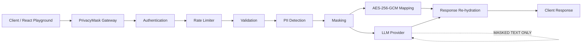

# PrivacyMask

**PrivacyMask is a real-time PII anonymizer and privacy gateway for AI pipelines.** It sits between your application and external LLM providers: before customer text reaches an external AI, PrivacyMask detects personally identifiable information (PII), replaces it with opaque tokens, and keeps an AES-256-GCM-encrypted mapping so the original values can be restored in the LLM response.

**External providers only ever receive masked text — never raw PII, mappings, or encryption keys.**

---

## Problem

Applications increasingly send user/customer text to external LLM providers. That text often contains PII such as email addresses, phone numbers, account identifiers, SSNs, and credit-card numbers.

Sending raw PII to third-party AI providers can increase privacy, compliance, and breach-impact risks.

## Solution

PrivacyMask acts as a gateway between an application and an external LLM provider.

```text
Client
  |
  v
PrivacyMask Gateway
  |
  +--> Authentication
  |
  +--> Rate Limiting
  |
  +--> Request Validation
  |
  +--> PII Detection
  |
  +--> Masking / Tokenization
  |
  +--> AES-256-GCM Encrypted Mapping
  |
  +--> LLM Provider
  |       |
  |       +--> Mock
  |       +--> OpenAI
  |       +--> Anthropic
  |
  +--> Response Re-hydration
  |
  v
Client
```

### Core privacy boundary

```text
RAW PII
  |
  v
PrivacyMask
  |
  +----> MASKED TEXT ----> External LLM
  |
  +----> ENCRYPTED MAPPING ----> Server-side only
  |
  v
RE-HYDRATED RESPONSE
```

**Raw PII never crosses the provider boundary.**

---

## Key Features

- Real-time PII detection and masking
- Opaque token replacement such as `{{EMAIL_001}}`
- AES-256-GCM encrypted token mappings
- Server-side response re-hydration
- Mock provider for local development and demonstrations
- OpenAI provider integration
- Anthropic provider integration
- API-key authentication using `X-API-Key`
- Constant-time API-key comparison
- Authentication before privacy processing
- Token-bucket rate limiting
- `429` responses with `Retry-After`
- Request-size validation
- Sanitized error responses
- Restricted CORS configuration
- Provider boundary that accepts masked text only
- React/Vite playground
- Frontend API key held in memory only
- No provider SDKs or provider credentials in the frontend
- Production-oriented security checks and regression tests

---

## Technology Stack

### Backend

- Java 21
- Spring Boot 3.3.5
- Spring WebFlux
- Spring Security
- Jakarta Validation
- Maven
- AES-256-GCM
- REST API

### Frontend

- React 18
- Vite
- Vitest
- Testing Library

### Security

- API-key authentication
- Constant-time credential comparison
- AES-256-GCM encryption
- Encrypted server-side mappings
- Rate limiting
- Restricted CORS
- Sanitized error envelopes
- Provider-boundary isolation
- No secrets in frontend code

---

## Architecture



The implemented processing order is:

```text
AUTH
  ->
RATE LIMIT
  ->
VALIDATION
  ->
DETECTION
  ->
MASKING
  ->
ENCRYPTED MAPPING
  ->
PROVIDER
  ->
RE-HYDRATION
```

---

## Example

### Input

```text
Customer john@example.com needs help with his refund.
```

### Masked provider input

```text
Customer {{EMAIL_001}} needs help with his refund.
```

The external provider receives only the masked text.

### Server-side mapping

Conceptually:

```text
{{EMAIL_001}} -> encrypted("john@example.com")
```

The plaintext mapping is not sent to the provider.

### Re-hydrated provider response

```text
Customer john@example.com needs help with his refund.
Mock analysis completed.
```

---

# API

## 1. GET `/api/v1/privacymask/status`

Public health/status endpoint.

Example:

```http
GET /api/v1/privacymask/status
```

Example response:

```json
{
  "application": "PrivacyMask",
  "status": "UP",
  "version": "0.1.0",
  "openaiConfigured": false,
  "anthropicConfigured": false,
  "securityConfigured": true,
  "rateLimitConfigured": true
}
```

The provider configuration fields expose configuration presence only. Provider credentials are never returned.

---

## 2. POST `/api/v1/privacymask/analyze`

Analyzes text, detects PII, masks it, sends the masked text to the selected provider, and re-hydrates the provider response.

### Authentication

```http
X-API-Key: <your-api-key>
```

### Request

```json
{
  "text": "Customer john@example.com needs help with his refund.",
  "provider": "mock"
}
```

Both `text` and `provider` are required.

### Response

Current response contract:

```json
{
  "requestId": "17af803a-e37d-4050-9007-6c068cc267d6",
  "originalText": "Customer john@example.com needs help with his refund.",
  "processedText": "Customer {{EMAIL_001}} needs help with his refund.",
  "provider": "mock",
  "status": "ANALYZED",
  "detections": [
    {
      "type": "EMAIL",
      "value": "john@example.com",
      "start": 9,
      "end": 25
    }
  ],
  "response": "Customer john@example.com needs help with his refund. Mock analysis completed."
}
```

### Important demo-contract note

The current MVP intentionally returns `originalText` and raw `detections[].value` in the response for development/demo transparency.

The frontend does **not** need these raw fields to display the masked result. The current UI displays detection metadata such as type and character range and displays the masked tokens.

This is a documented MVP limitation, not a provider-boundary exception.

A future version can introduce a deliberately versioned response contract that removes raw PII from the default response.

---

# Supported Providers

## Mock

Recommended for local development and demonstrations.

```json
{
  "text": "Customer john@example.com needs help.",
  "provider": "mock"
}
```

The mock provider does not require an external API credential.

## OpenAI

OpenAI requests receive only the masked text.

The OpenAI API key remains backend-only.

## Anthropic

Anthropic requests receive only the masked text.

The Anthropic API key remains backend-only.

### Provider security rule

Providers must never receive:

- Raw PII
- Encryption mappings
- Encryption keys
- Frontend API keys
- Internal mapping identifiers containing plaintext PII

---

# Security Model

## Authentication

The `/analyze` endpoint requires an API key.

Authentication is performed before privacy-sensitive processing.

Missing or incorrect API keys result in `401 Unauthorized`.

API-key comparison uses constant-time comparison.

---

## Rate Limiting

Rate limiting is applied to `/analyze`.

The current implementation uses an in-memory token-bucket limiter.

When the limit is exceeded:

```text
HTTP 429 Too Many Requests
```

The response includes:

```text
Retry-After
```

Unauthenticated requests do not consume authenticated request quota.

### Current limitation

The limiter is single-instance and in-memory.

For a multi-instance production deployment, a shared distributed rate limiter such as Redis would be required.

---

## PII Detection

The current implementation uses regex/rule-based detection.

The implemented detection system includes PII categories supported by the current codebase, including email, phone and other supported structured identifiers.

The current MVP does not implement `PERSON_NAME` NLP detection.

---

## Masking

Detected PII is replaced with opaque tokens.

Example:

```text
john@example.com
```

becomes:

```text
{{EMAIL_001}}
```

The provider receives the masked representation.

---

## Encryption

Mappings are protected using:

```text
AES/GCM/NoPadding
```

with:

- 256-bit key
- Fresh 12-byte nonce
- 128-bit authentication tag
- Strict Base64 decoding
- Exact 32-byte decoded key requirement

The encryption key must be supplied through configuration/environment.

It must never be hard-coded into source code.

---

## Mapping Storage

The current MVP keeps encrypted mappings in memory with a TTL.

The mapping store contains ciphertext rather than plaintext PII.

### Current limitation

The mapping store is:

- In-memory
- Single-instance
- Non-persistent

A future production deployment can replace this with an appropriate distributed/persistent storage design.

---

## Response Re-hydration

The provider response is processed server-side.

Opaque tokens are replaced with their original values using the server-side encrypted mapping.

The frontend never receives the encryption key.

---

## Frontend Security

The frontend:

- Does not perform PII detection
- Does not perform encryption
- Does not contain provider credentials
- Does not call OpenAI directly
- Does not call Anthropic directly
- Does not store the API key in localStorage
- Does not store the API key in sessionStorage
- Keeps the API key in memory during the session

The frontend communicates with the PrivacyMask backend only.

---

## CORS

CORS is restricted to explicitly configured origins.

Wildcard:

```text
*
```

is rejected rather than being treated as a valid production origin.

Credentials are not enabled.

---

## Logging

Application logging intentionally avoids:

- Request bodies
- Raw PII
- API keys
- Provider credentials
- Encryption keys
- Encryption mappings
- Ciphertext

Logs contain operational metadata such as request IDs, method/path, provider names, counts and status information.

---

## Error Handling

The API uses sanitized error envelopes.

Example:

```json
{
  "timestamp": "2026-09-25T13:41:18.645Z",
  "status": 400,
  "error": "Bad Request",
  "message": "Invalid request.",
  "path": "/api/v1/privacymask/analyze"
}
```

Internal stack traces, secrets and implementation details are not returned to clients.

---

# Configuration

Backend configuration is environment-driven.

Important variables include:

```text
PRIVACYMASK_APP_NAME
PRIVACYMASK_APP_VERSION
PRIVACYMASK_ENCRYPTION_KEY
PRIVACYMASK_MAPPING_TTL
PRIVACYMASK_MAX_TEXT_LENGTH
PRIVACYMASK_PROVIDER_TIMEOUT
PRIVACYMASK_API_KEY
PRIVACYMASK_CORS_ALLOWED_ORIGINS
PRIVACYMASK_RATE_LIMIT_ENABLED
PRIVACYMASK_RATE_LIMIT_CAPACITY
PRIVACYMASK_RATE_LIMIT_REFILL_PER_MINUTE
PRIVACYMASK_OPENAI_API_KEY
PRIVACYMASK_OPENAI_BASE_URL
PRIVACYMASK_OPENAI_MODEL
PRIVACYMASK_ANTHROPIC_API_KEY
PRIVACYMASK_ANTHROPIC_BASE_URL
PRIVACYMASK_ANTHROPIC_MODEL
PRIVACYMASK_ANTHROPIC_API_VERSION
```

Frontend:

```text
VITE_PRIVACYMASK_API_URL
```

---

# Encryption Key Generation

The encryption key must be Base64 encoding of exactly 32 random bytes.

## PowerShell

```powershell
$b = New-Object byte[] 32
[Security.Cryptography.RandomNumberGenerator]::Create().GetBytes($b)
$env:PRIVACYMASK_ENCRYPTION_KEY = [Convert]::ToBase64String($b)
```

Do not use a raw 32-character ASCII string as the value.

Incorrect:

```text
01234567890123456789012345678901
```

Correct format:

```text
<base64 encoding of 32 random bytes>
```

Never commit a real encryption key.

---

# Environment Examples

The repository contains `.env.example` templates.

They contain placeholders only.

For local development, configure environment variables in your shell rather than committing `.env` files.

---

# Local Development

## Requirements

Backend:

```text
Java 21
Maven 3.9+
```

Frontend:

```text
Node.js
npm
```

---

## Start Backend

From PowerShell:

```powershell
cd C:\Users\beher\OneDrive\Desktop\PrivacyMask\privacymask-backend

$env:PRIVACYMASK_API_KEY="test-service-key"

$b = New-Object byte[] 32
[Security.Cryptography.RandomNumberGenerator]::Create().GetBytes($b)
$env:PRIVACYMASK_ENCRYPTION_KEY = [Convert]::ToBase64String($b)

$env:PRIVACYMASK_CORS_ALLOWED_ORIGINS="http://localhost:5173"

mvn spring-boot:run "-Dspring-boot.run.arguments=--server.port=8081"
```

The backend is then available at:

```text
http://localhost:8081
```

---

## Start Frontend

Open another terminal:

```powershell
cd C:\Users\beher\OneDrive\Desktop\PrivacyMask\frontend

npm install
npm run dev
```

The Vite development server normally runs at:

```text
http://localhost:5173
```

---

# Manual API Test

The repository contains a local `request-valid.json` payload for manual testing.

From the backend directory:

```powershell
cd C:\Users\beher\OneDrive\Desktop\PrivacyMask\privacymask-backend
```

Status:

```powershell
curl.exe http://localhost:8081/api/v1/privacymask/status
```

Analyze:

```powershell
curl.exe -i `
  -X POST `
  "http://localhost:8081/api/v1/privacymask/analyze" `
  -H "Content-Type: application/json" `
  -H "X-API-Key: test-service-key" `
  --data-binary "@request-valid.json"
```

Expected:

```text
HTTP/1.1 200 OK
```

with masked output similar to:

```text
Customer {{EMAIL_001}} needs help with his refund.
```

and a re-hydrated response.

---

# Frontend Playground

The React playground provides:

- Gateway status
- Pipeline visualization
- Text input
- Provider selection
- API-key input
- Masked result display
- Detection metadata
- Provider response
- Request ID/status information

The API key is held in browser memory only.

The frontend does not store it persistently.

---

# Testing

## Backend

Run:

```powershell
cd privacymask-backend
mvn clean test
```

Verified baseline:

```text
Tests run: 361
Failures: 0
Errors: 0
Skipped: 0

BUILD SUCCESS
```

The test suite covers:

- Authentication
- Missing API key
- Invalid API key
- Security isolation
- Rate limiting
- Rate-limit concurrency
- Request validation
- Malformed JSON
- Oversized requests
- PII detection
- Masking
- Encryption
- Invalid encryption keys
- Mapping protection
- Response re-hydration
- Provider boundaries
- OpenAI boundary
- Anthropic boundary
- Error handling
- CORS
- Configuration
- Regression cases

---

## Frontend

Run:

```powershell
cd frontend
npm test -- --run
```

Verified baseline:

```text
2 test files
14 tests passed
0 failed
```

---

## Production Build

```powershell
npm run build
```

Verified build:

```text
37 modules
BUILD PASS
```

---

# Security Verification

The current release has been manually verified for:

| Scenario | Expected |
|---|---|
| No API key | `401` |
| Wrong API key | `401` |
| Valid API key | `200` |
| Invalid JSON | `400` |
| Unsupported provider | `400` |
| Oversized request | `413` |
| Provider failure | `502` |
| Encryption failure | `500` |
| Rate-limit exhaustion | `429` |
| Valid PII request | `200` |
| Provider receives masked text | PASS |
| Response re-hydration | PASS |
| CORS restricted | PASS |

---

# Current API Privacy Contract

The current MVP response contains:

```text
requestId
originalText
processedText
provider
status
detections
response
```

`detections` currently contains:

```text
type
value
start
end
```

### Why this exists

The current contract was deliberately retained as a transparent development/demo contract.

It makes it easy to demonstrate:

1. What the client sent.
2. What PrivacyMask detected.
3. What PrivacyMask masked.
4. What the provider received.
5. What the server re-hydrated.

### Important privacy limitation

`originalText`, `detections[].value`, and the re-hydrated `response` can contain sensitive information.

Consumers should therefore avoid logging or persistently storing complete `/analyze` responses.

### Future contract

A future version can introduce a versioned API response that removes unnecessary raw PII from the response boundary while retaining useful metadata such as:

```text
requestId
processedText
provider
status
detections[type,start,end]
response
```

No such breaking API change is part of the current MVP.

---

# Production Considerations

PrivacyMask is currently **MVP/release-ready**, but several production-scale capabilities are intentionally deferred.

Before a high-scale deployment, consider:

- Distributed rate limiting
- Persistent/distributed mapping storage
- TLS termination at a reverse proxy/load balancer
- Secret management through a dedicated secrets manager
- Production-specific rate-limit values
- Observability/metrics
- Centralized operational logging with strict PII controls
- Horizontal scaling strategy
- Production deployment/containerization
- More advanced PII detection
- Policy-based privacy controls
- Versioned API contract without raw PII echo
- Authentication/authorization for an administrative dashboard

---

# Known Limitations

The current MVP intentionally does not include:

- PostgreSQL persistence
- Redis
- Kafka
- Docker deployment
- `PERSON_NAME` NLP detection
- Policy engine
- Dashboard authentication
- Distributed mapping storage
- Distributed rate limiting
- Version 2 privacy response contract
- Production TLS termination inside the application
- Multi-instance shared state

These are deferred scope items rather than hidden implementation gaps.

---

# What PrivacyMask Protects

PrivacyMask is designed around a specific boundary:

```text
YOUR APPLICATION
       |
       | Raw PII
       v
+--------------------+
|    PrivacyMask     |
|                    |
| Detect             |
| Mask               |
| Encrypt mapping    |
+--------------------+
       |
       | Masked text only
       v
+--------------------+
| External LLM       |
| Provider           |
+--------------------+
       |
       | Masked response
       v
+--------------------+
|    PrivacyMask     |
|                    |
| Re-hydrate         |
+--------------------+
       |
       | Response
       v
YOUR APPLICATION
```

The key security guarantee is:

> **External providers receive masked text only.**

They do not receive:

- Raw PII
- Encryption mappings
- Encryption keys
- Provider credentials belonging to the application

---

# Repository Structure

```text
PrivacyMask/
|
├── privacymask-backend/
│   ├── src/
│   │   ├── main/
│   │   │   └── java/
│   │   │       └── com/
│   │   │           └── privacymask/
│   │   ├── test/
│   │   ├── pom.xml
│   │   └── .env.example
│   │
│   └── README / local configuration
│
├── frontend/
│   ├── src/
│   ├── package.json
│   ├── package-lock.json
│   ├── vite.config.js
│   └── .env.example
│
├── .gitignore
├── LICENSE
└── README.md
```

Generated files such as:

```text
target/
node_modules/
dist/
```

are ignored by Git.

Local request payloads and operational scratch files are also excluded through `.gitignore`.

---

# GitHub Release

PrivacyMask is maintained as a Git repository.

The release contains:

- Backend source
- Backend tests
- Frontend source
- Frontend tests
- README documentation
- Environment templates
- Git ignore rules
- MIT license

No production secrets should be committed.

Never commit:

```text
.env
```

real API keys, encryption keys, provider credentials, certificates, passwords, or operational secrets.

---

# License

MIT License.

See [`LICENSE`](LICENSE).

---

# Status

**PrivacyMask MVP: RELEASE READY WITH DOCUMENTED LIMITATIONS**

Verified:

```text
Backend tests:   361 passed
Frontend tests:   14 passed
Frontend build:   PASS
API smoke test:   PASS
Authentication:   PASS
Rate limiting:    PASS
PII masking:      PASS
Encryption:       PASS
Provider boundary: PASS
Re-hydration:     PASS
CORS:             PASS
Error handling:   PASS
```

The current implementation is suitable as a portfolio/GitHub MVP demonstrating:

- Java
- Spring Boot
- Spring WebFlux
- Spring Security
- REST APIs
- React
- PII detection
- Data masking
- AES-256-GCM
- API security
- Rate limiting
- LLM privacy boundaries
- Automated testing
- Secure response re-hydration

---

## Reserved for Later

Explicitly not built in the current MVP:

- `PERSON_NAME` NLP detection
- Policy engine
- PostgreSQL persistence
- Dashboard authentication
- Redis
- Kafka
- Docker deployment
- Distributed state
- Version 2 response contract without raw-PII echo
